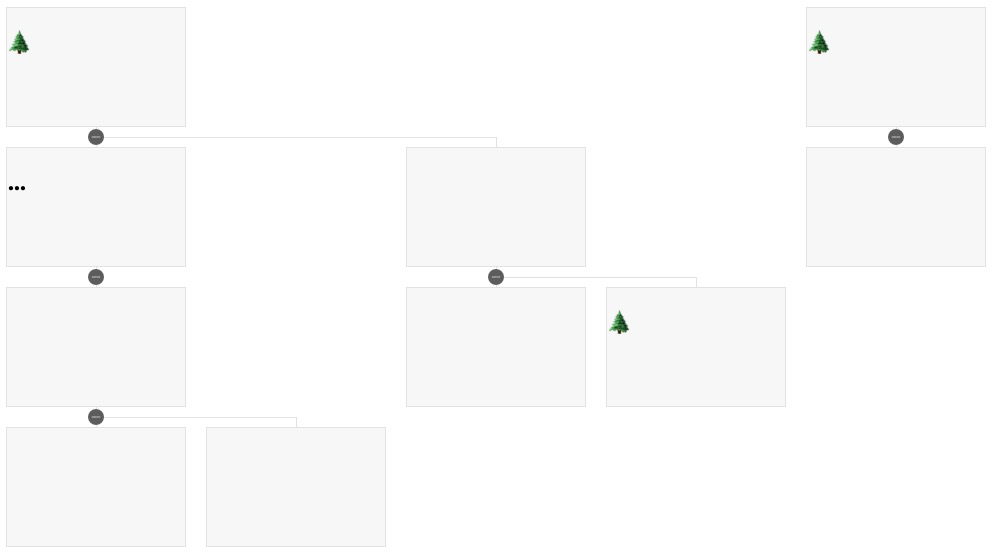

# vue-card-tree

A vue component that shows data in a tree of cards.

树状图展示数据，每个节点是个卡片。如下图所示。



## how to use
```
first: npm install -S vue-card-tree
```
```html
then: use it in the *.vue file:

<vue-card-tree :treeData="treeData" childKeyName="xx">
    <template v-slot="{boxProps}">
        <h2>{{boxProps.text}}</h2>
    </template>
<vue-card-tree>

<script>
import vueCardTree from 'vue-card-tree'
import 'vue-card-tree/vue-card-tree.css'
export default {
    component: { vueCardTree }
}
</script>
```

## API

| type | name | description |
| --- | --- | --- |
| attr | treeData | an array which contains the data. |
| attr | childKeyName | string that is the key of children data. |
| slot scope variable | boxProps | a variable used in the parent component that makes it possible to display data in each card